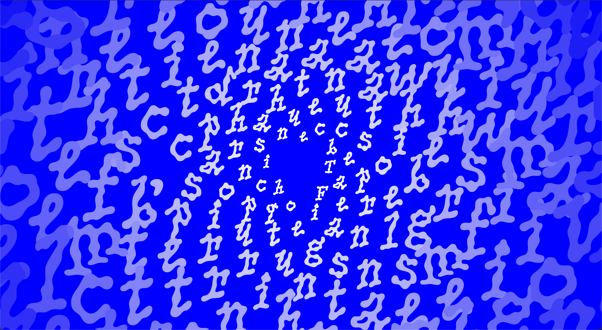

# Fibonacci Text

An interactive web animation that transforms text about the Fibonacci sequence into a golden spiral pattern. As you scroll, individual characters animate from their spiral positions back to form the original paragraph, revealing the mathematical beauty of the Fibonacci sequence.

## Features

- **Golden Spiral Animation**: Characters are arranged using the golden angle (φ) to create a natural Fibonacci spiral
- **Scroll-triggered Animation**: GSAP ScrollTrigger animates characters back to their original positions as you scroll
- **Dynamic Typography**: Font sizes increase along the spiral, creating depth and visual hierarchy
- **Gradient Coloring**: Characters transition from white to black along the spiral
